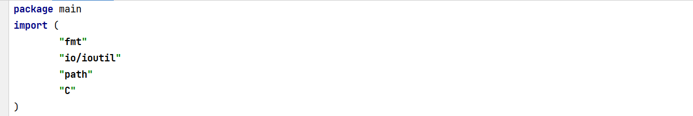
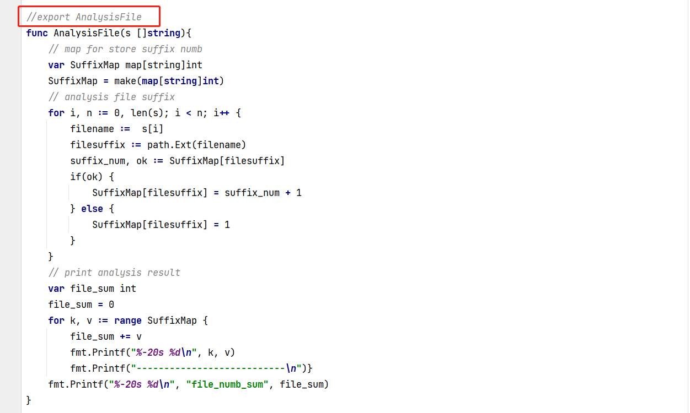
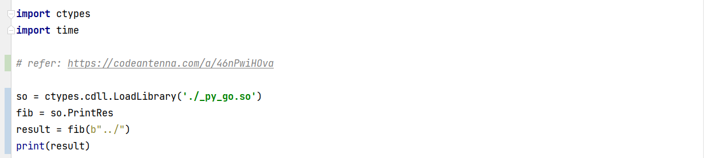

# python 调用 go 注意点

### 注意点

* go 中要 import "C"

* go 函数中，加入 export 语句

### go 函数需要传入字符串

* go 中接受字符创使用 *C.char 代替 string

* go 中接受到 string 之后使用前需要先进行转换，C.GoString(analysis_dir)

* python 调用时候转为二进制，在字符串之前加入 b

### 编译

go build -buildmode=c-shared -o _py_go.so py_go.go

### 调用

